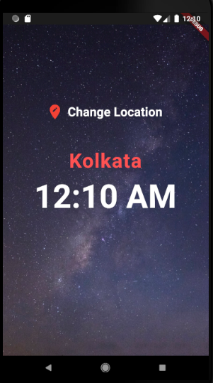
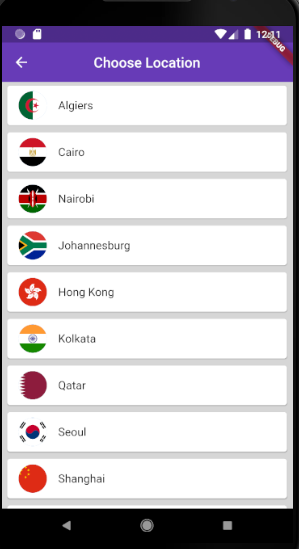
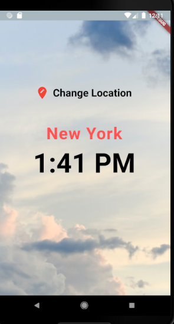

# worldclock

Flutter Application for getting World-Time.

## Interface
<b>Starting the app</b>

</img>

On running the app it gives time at a place (here Kolkata), If the time is of Night, the theme is of Dark Mode. 
 
<b>Change Location</b>
On selecting the option of Changing the location we get an interface like this:

</img>

Here we get to select the Location name there is Flag of the country infront of the location, Once we select the location we get to the Home screen again with the location changed to the new selected location and Time as of the choosen location.

 
<b>New Location Timing</b>

</img>

Here we can see the time corresponds to day time and hence the theme is changed to Light Mode
